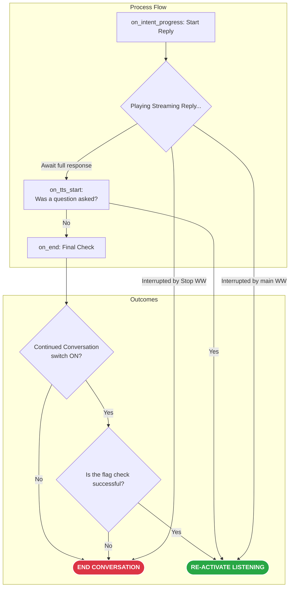

# esp32s3-VA
Voice assistant satellite for Home Assistant.
Amateur Esphome firmware for esp32-s3 with PSRAM for continued conversation. 

Tested on clones from Aliexpress for 5$ with modules INMP441+MAX98357A. I don't use RGB led on the board, instead I connected a regular single-color red led (GPIO10), which turns on at the listening stage. This can be improved if there is a need.

I recommend using the pin of the linear stabilizer and the shortest possible wire to get power to the microphone. I encountered noise when using the 3.3V pad near the antenna. Be sure to record your voice in the [HA](https://www.home-assistant.io/voice_control/troubleshooting/#to-tweak-the-assist-audio-configuration-for-your-device) to evaluate the quality.

After the answer is voiced, the listening stage is re-enabled. The waiting time for the start of speech is set in the listening_timeout script. To disable the session, you can wait for this period or use one of the words from the `homeassistant_HassNevermind` intent (add your own if needed).

- Continued Conversation - always starts a new session upon receiving a response from the LLM
- Continued Conversation+ - after any response or audio confirmation.

I don't use buttons, so the timer is turned off by voice, you have to say the wake word. But this is easily modified.

First, install a clean firmware version on your module to get the keys for api and ota. You will also need sound files (duration matters), you can make them yourself or use mine. Copy them to the esphome directory or use the links to them.

A known issue: ~~if tts generates text longer than 5 seconds, the session is interrupted, this is a common problem.~~ Was fixed in 2025.07

~~But in my variant wakeword is not enabled on on_end trigger, because the flag is activated. I have to restart WW manually. This problem is rare when using a good tts module and adequate response token limit.~~  WW never turns off now.

The end result is a great tool for testing language models as conversation partners, it's quite fun. If the board is used in a quiet place, you should have no problems with the quality of recognition. For noisy places, consider purchasing a [reSpeaker Lite](https://github.com/formatBCE/Respeaker-Lite-ESPHome-integration) or [VPE](https://www.home-assistant.io/voice-pe/)

